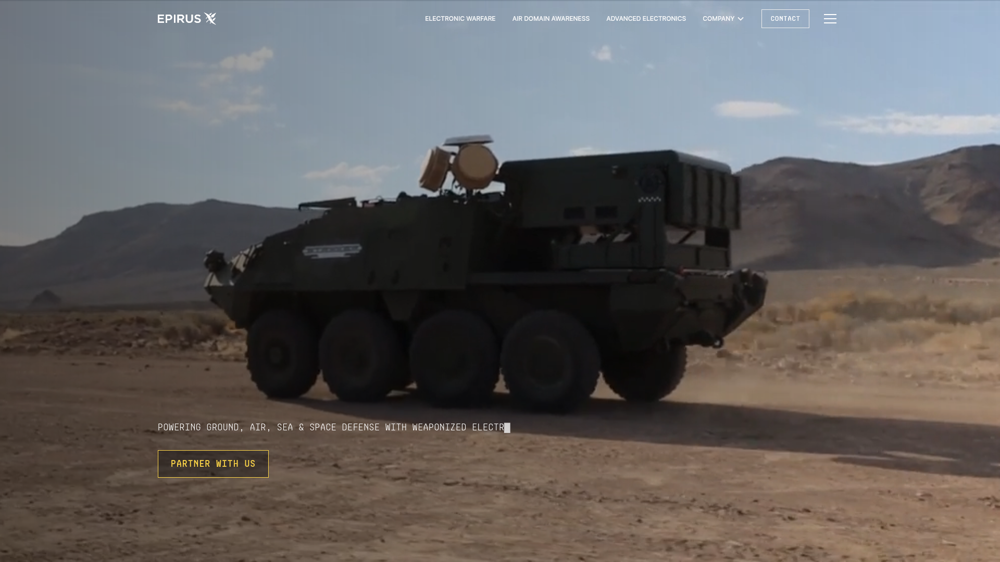
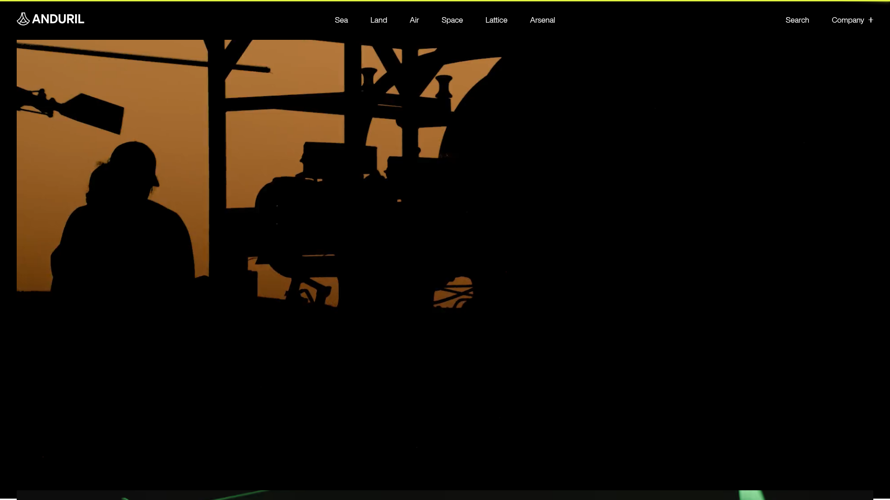
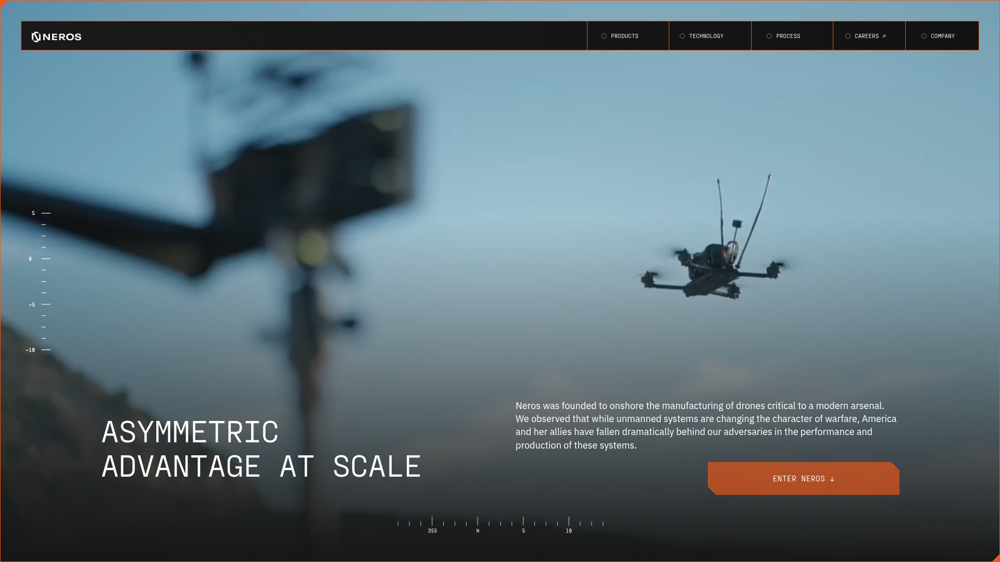

# Sinthos Inc — website design direction

Research date: 16 September 2026. Audience: counter-UAS integrators, researchers, field-test partners, and early-stage investors.

## Positioning

Sinthos is developing passive acoustic sensing for small drones, including the detection challenge posed by fibre-optic control links. Present a development program and a serious technical thesis. There is no verified Sinthos performance, deployment, proprietary hardware, customer roster or funding to advertise. Do not explain the company name or river origin. Position Sinthos as a defense technology company with long-term ambition; acoustic detection is the first program.

## Research observations

- Epirus: mission first, then clearly named capabilities and a direct partner CTA. Its site uses oversized sans-serif text, square controls, yellow accent, hardware media, and dated evidence. Source: https://www.epirusinc.com/ . Firecrawl branding/image extraction in work/epirus-branding.json. Sinthos should adopt the clarity of capability and partnership intent.
- Neros: very direct product narrative, dark/light contrast, compact navigation, orange identity, engineering detail and manufacturing credibility. Source: https://www.neros.tech/ . Extraction in work/neros-branding.json. Adopt specificity and strong hierarchy; do not imitate product claims or its distinctive orange identity.
- Anduril: a broad defense-platform presentation. Source: https://www.anduril.com/ . The screenshot shows a black architectural layout, a single acid-yellow top rule, compact white navigation arranged by domain, and full-scale mission imagery. Its JS-heavy site yielded low-confidence font extraction; do not treat scraped Times New Roman as an intentional design choice. Adopt the mission and platform hierarchy, scaled honestly to a company with one initial program.

## Chosen visual thesis

Engineering an advantage. Cinematic terrain imagery as operating context; large quiet typography; graphite, mineral white, and a narrow pale-lime accent; a generous editorial layout; an animated acoustic field rather than fictitious hardware. Build confidence through specificity and evidence instead of claims of maturity.

## Tokens

- Background: #111713. Surface: #19221d. Text: #eff1e9. Muted text: #aab5aa.
- Light section: #eceee7 with #1d2820 text. Accent: #d1e5a5. Borders: translucent current foreground.
- Headings: Manrope, 400/500, close tracking, desktop hero 104–124px, mobile 52–66px. Body: Manrope, 16–20px. Metadata: IBM Plex Mono, 12–14px.
- Maximum content width 1440px, desktop gutter 64px; mobile gutter 24px. Section spacing 100–140px desktop, 70–90px mobile.
- Square buttons, one thin rule per structural boundary, no generic feature-card grid, no glossy gradients or stock military photography.

## Page structure

1. Full-bleed river-valley hero: mission, explanatory paragraph, approach CTA, contact CTA.
2. Light editorial problem statement: why a missing RF link creates a sensing gap.
3. Dark interactive sensing study: Listen / Interpret / Inform, an illustrative sound field, and concise development goals.
4. Research-led development program: benchmark, evaluate, validate. External primary-source references distinguish demand from product proof.
5. Company mission: an enduring defense technology company, beginning with perception and a research-led first program.
6. Direct collaboration invitation, founder email, minimal footer.

## Motion and access

Slow landscape drift, restrained scroll reveals, interactive canvas signal animation. No autoplay audio, scroll hijacking, fake live telemetry, or fabricated performance. Respect reduced motion; a persistent pause control stops the field animation. Mobile layout stacks without hiding essential copy. Semantic headings, visible keyboard focus, usable touch targets, and source references.

## Asset provenance

Original river-valley image generated for this project, inspired by the Indus rather than claimed to document a particular location. No third-party logos, photos or proprietary product renders reused. Fonts are Google Fonts families under their respective open licenses.

## Contact

subhro@sinthosinc.com (provided by founder).

## Captured visual references

Screenshots captured for comparative design research only. No competitor images, logos or copy are used in the public site.

### Epirus

### Anduril

### Neros

